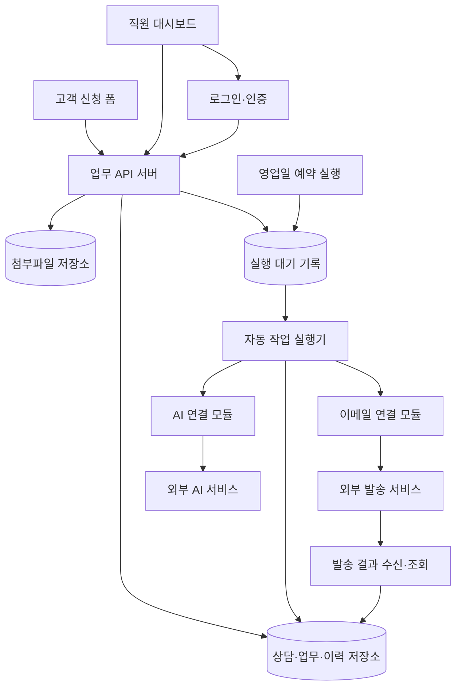

# 4차 시스템 구조 설계 및 기능 명세 — 1차안

작성일: 2026-09-12

프로젝트: 고객 상담·후속 업무 누락 방지 대시보드

대상: AI 리빙랩 수업의 가정 기반 시제품

이 문서는 인터뷰에서 정한 동작을 구축 가능한 규칙으로 정리한 논리 설계다. 실제 기업에서 확인된 요구사항이나 구축·배포 완료 보고서가 아니다. API 주소, 내부 데이터 이름, 실행 제어 방식은 설계 제안이며, 특정 외부 서비스의 실제 API를 인용한 것이 아니다.

**구조·배포 설계 업데이트:** Railway 싱가포르, Emergent 실시간 문의 연결, CRM 단독 수정, GitHub 본인 승인 배포를 적용한 [확장 구조 최신안](04b-railway-scalable-architecture.md)이 이 문서의 인프라 관련 미정 사항과 단일 실행기 구조를 보완한다. 첫 연락 기준·직원 승인·업무 상태 등 업무 규칙은 유지한다.

**AI 권한 업데이트:** 최신안 3.2에 따라 영업 기록·다음 행동 등 허용된 내부 업무는 AI가 직접 반영할 수 있다. 아래 본문의 ‘AI 제안은 모두 직원 확인 후 반영’은 초기안의 기록이며, 해당 내부 업무에는 최신 권한 기준이 우선한다. 고객 후속 연락의 직원 승인과 시스템 설정 변경 금지는 유지한다.

**핵심 API 계약:** 전체 영업건 관리, 기한 미정 처리, 직원 확인 후 종료·재배정을 반영한 [핵심 업무 API 계약 v1](04d-core-api-contract.md)이 아래 초기 API 표보다 우선한다. 외부 공급자별 연결 세부값은 아직 확정 전이다.

## 1. 결정 사항과 남은 결정

| 구분 | 내용 |
|---|---|
| 적용 범위 | 한 기업의 고객 상담부터 계약 후 서비스 제공까지 관리 |
| 이용 방식 | 고객은 공개 신청 폼, 직원은 로그인한 웹 대시보드 사용 |
| 저장 | 상담·업무·파일·이력을 저장하고 재접속 후 이어서 사용 |
| 배정 | 신규 상담은 지정된 전담 직원 한 명에게 자동 배정 |
| 비용 | 무료 범위를 우선. 유료 사용은 별도 확인 전 활성화하지 않음 |
| AI | 메모 저장 시 자동 정리. 직원이 확인한 제안만 실제 업무에 반영 |
| 고객 이메일 | 상담 저장 후 접수 확인 메일 자동 발송. 후속 연락 초안은 직원 승인 후 발송 |
| 시간 | 한국 시간 Asia/Seoul. 영업일은 월~금 중 공휴일 제외 |
| 첫 연락 | 접수일의 다음 영업일 17:00까지 전화. 부재 시 안내 문자와 회신 방법을 남김 |
| 핵심 목표 | 기한 내 첫 연락 수행률 100%. 실제 통화 연결률은 별도로 측정 |
| 15:00 배치 | 기한 초과·오늘 마감 미완료 업무를 담당자별 한 통으로 안내 |
| 16:30 배치 | 오늘 17:00 마감인 첫 연락 미완료 건만 추가 안내 |
| 재시도 | 일시적 오류에 한해 최초 실행 포함 총 3회. 최종 실패 시 수동 처리 필요 표시 |
| 외부 기록 수집 | 외부 전화·문자·수신 이메일 자동 수집은 추후 확장 |

아직 결정되지 않은 항목:

- 호스팅·데이터베이스·파일 저장소·인증·AI·이메일 서비스의 실제 제품과 계정.
- 이메일 발신 주소와 도메인 인증 방식, 무료 한도, 발송 상태 확인 기능.
- 영업일 계산에 사용할 공휴일 목록의 출처와 갱신 방식. 시연용 달력의 범위·버전을 기록할 것.
- 무료 호스팅에서 예약 실행이 가능한지, 중단·지연 시 복구 방법.
- 대체 담당자 등 실제 인력 구성, 파일 허용 형식·용량, 데이터 보관·삭제 기간.
- 서비스 범위 밖 문의와 고객이 늦은 연락을 요청한 경우의 KPI 예외 처리. 기본 결과와 예외 사유를 함께 표시하고 임의로 성공 처리하지 않을 것.

## 2. 구조 설계



구성요소를 설명하기 위한 구분이다. 시제품에서는 하나의 서버가 여러 역할을 담당할 수 있고, 별도 유료 작업 큐를 반드시 도입할 필요는 없다.

### 2.1 각 구성의 책임

- 고객 신청 폼: 필수 정보 입력, 제출 결과와 접수번호 표시. 내부 상담을 조회하는 권한은 없음.
- 직원 대시보드: 오늘 할 일, 상담 단계별 보기, 상담 상세, AI 제안 확인, 실행 실패 안내.
- API 서버: 인증·권한·데이터 검증, 기한 계산, 업무 변경, 실행 요청 저장. 비밀키는 서버에만 보관.
- 데이터베이스: 업무의 기준 기록. 화면이 닫혀도 기록과 예약 실행 대상이 유지됨.
- 파일 저장소: 상담과 연결된 비공개 첨부파일 보관. 상담 접근 권한을 확인한 뒤 내려받기 허용.
- 실행 대기 기록: 아직 수행하지 않은 AI·메일 작업, 재시도 시각, 실행 결과를 보관.
- 실행기: 예약 시각과 실행 조건을 확인해 작업 수행. 일시 실패·최종 실패·결과 불명확을 구별.
- 외부 연결 모듈: 내부 데이터 형식과 외부 서비스 형식을 변환. 서비스 교체 시 영향 범위를 제한.

### 2.2 핵심 처리 흐름

**상담 접수**

1. 신청 필수값을 검증한다.
2. 상담, 전담 담당자, 첫 연락 업무·기한, 접수 확인 메일 발송 요청을 함께 저장한다.
3. 저장이 성공하면 고객에게 접수번호를 보여준다.
4. 실행기가 고객 접수 확인 이메일과 직원 접수 알림을 발송한다.
5. 발송에 실패해도 저장된 상담을 지우거나 고객에게 다시 접수하도록 요구하지 않는다.

상담 저장과 발송 요청 저장은 함께 성공하거나 함께 실패하도록 구성한다. 이 방식을 통해 상담은 저장됐는데 메일 요청 자체가 사라지는 일을 방지한다.

**메모 및 AI 정리**

1. 원문 메모와 수정 버전을 먼저 저장한다.
2. 비어 있지 않은 메모의 새 버전에 대해 AI 정리 작업을 등록한다.
3. AI는 고객 요청 요약, 다음 행동 후보, 기한 후보, 근거, 확인이 필요한 사항을 반환한다.
4. AI 결과 형식을 검증하고 직원 검토 대상으로 저장한다.
5. 직원이 확인·수정한 제안만 업무나 상담 단계 변경으로 반영한다.

빈 메모에는 AI 작업을 만들지 않는다. 같은 버전의 메모를 재전송했다고 AI를 중복 호출하지 않는다. 분석 도중 메모가 바뀌면 이전 버전의 결과를 최신 제안으로 표시하지 않는다.

**승인 후 이메일 발송**

1. 직원이 수신자·제목·본문·첨부파일을 확인한다.
2. 승인한 내용의 버전을 고정하고 발송 작업을 등록한다.
3. 실행 직전 상담 종료, 업무 완료, 수동 처리 여부를 다시 확인한다.
4. 외부 서비스의 발송 상태를 기록한다.
5. 실제 발송 성공이 확인됐을 때만 연결된 ‘이메일 보내기’ 업무를 완료한다.

발송 요청 접수, 실제 발송, 고객 수신, 고객 열람·회신은 서로 다르다. HTTP 성공 응답이나 요청 접수만으로 고객에게 전달됐다고 표시하지 않는다. 실제 서비스의 상태 의미는 I/F 확정 때 대응표로 작성한다.

## 3. 데이터와 상태의 공통 규칙

### 3.1 주요 기록

| 기록 | 핵심 항목 |
|---|---|
| 상담 | 접수번호, 고객 구분, 이름/업체명, 고객 담당자명, 연락처, 이메일, 회사 규모, 요청 메모, 담당 직원, 접수 시각, 진행 단계 |
| 할 일 | 연결 상담, 할 일, 담당자, 원래 기한, 현재 기한, 미완료/완료, 관리 제외 여부·이유, 실제 완료 시각 |
| 연락 결과 | 연결 상담·업무, 연락 방법·결과, 실제 연락 시각, 입력·수정 시각, 입력자, 선택 메모 |
| AI 제안 | 원문 메모 버전, 연결 업무, 제안 내용·근거, 기한 후보, 검토 결과, 제외 이유 |
| 발송 작업 | 연결 업무·제안, 승인된 내용 버전, 수신자, 외부 발송 식별번호, 발송 상태, 실행 횟수 |
| 자동 작업 | 작업 종류, 대상, 예정 시각, 다음 실행 시각, 실행 상태, 중복 방지 키, 오류 분류 |
| 변경 이력 | 변경 전·후 값, 수행자, 시각, 사유, 관련 요청 식별번호 |

고객 구분은 개인/기업·단체로 제안한다. 이름/업체명, 연락처, 이메일, 요청 메모는 필수다. 기업·단체 고객은 고객 담당자명을 입력하며, 회사 규모는 선택이다. 규모 값은 1인/2~9명/10~49명/50~299명/300명 이상/모름으로 한다.

### 3.2 업무 규칙

- 상담 단계: 접수 → 상담 진행 → 제안·협의 → 계약 완료 → 서비스 진행 → 서비스 완료. 중도 종료는 별도 ‘종료’ 및 이유 기록.
- 개별 업무 상태는 미완료/완료 두 가지. 관리 제외는 완료로 계산하지 않고 별도 사유를 보관.
- 기한 초과는 별도 경고이며, 업무 상태를 새로 만들지 않는다.
- 첫 연락 결과가 통화 연결 또는 부재 후 안내 문자 발송인 경우 첫 연락 수행 완료. 전화만 시도한 경우 미완료 유지.
- 메모 없이도 연락 결과를 기록할 수 있다.
- 실제 연락 시각은 기본 현재 시각으로 제시하되 수정 가능. 실제 시각과 서버 입력 시각을 각각 보관한다. 미래 시각·날짜 형식 오류를 거부하고 수정 이력을 남긴다.
- 기한을 변경해도 원래 기한을 유지한다. 기한 변경으로 이미 발생한 지연 실적을 지우지 않는다.
- 고객 답변 대기는 현재 상담 단계를 유지하고 다음 확인 날짜로 관리한다.
- 등록된 미완료 업무·다음 확인 날짜가 없는 진행 중 상담은 첫 화면의 ‘확인이 필요한 항목’에 표시한다.
- 업무와 연결된 AI 제안은 같은 카드에 표시한다. 업무 완료·제외 시 연결 제안을 함께 정리한다.
- 상담 종료·서비스 완료 전 남은 업무와 중단될 알림을 보여주고 직원 확인을 받는다. 남은 미완료 기록은 유지한다.

## 4. API 명세

아래 경로는 우리 시제품 서버를 위한 제안이다. `/api/v1`을 공통 접두어로 사용한다. 실제 인증·파일 서비스가 정해지면 일부 경로는 해당 서비스와의 연결 방식에 맞춰 조정한다.

### 4.1 공통 계약

- 로그인 API의 구체적 구현은 인증 서비스 선정 후 확정. 직원 API는 인증된 사용자 정보로 권한을 확인한다.
- 관리자에게는 해당 기업 전체, 일반 직원에게는 자신의 담당 상담·업무만 허용한다.
- 사용자·회사 식별값을 요청 본문에 넣어 보냈다는 이유만으로 권한을 인정하지 않는다.
- 날짜·시각은 시간대가 포함된 ISO 8601 형식으로 전달한다. 내부 저장은 일관된 기준을 사용하고 화면·영업일 계산은 Asia/Seoul로 해석한다.
- 생성·승인·발송 등 중복에 민감한 요청에는 `Idempotency-Key`를 사용한다. 같은 키·같은 내용이면 기존 결과를 반환하고, 같은 키·다른 내용이면 거부한다.
- 변경 요청에 `expectedVersion`을 포함해 다른 직원이 이미 변경한 기록을 덮어쓰지 않도록 한다. 충돌 시 최신 내용을 다시 확인하게 한다.
- 비동기 작업은 `jobId`와 대기 상태를 반환한다. 요청 접수를 실행 완료로 표시하지 않는다.

### 4.2 기능별 요청·응답

| 방법·경로 | 권한 | 필수 입력·조건 | 성공 결과 |
|---|---|---|---|
| `POST /inquiries` | 공개 | 신청 필수값, 중복 방지 키 | `201` 접수번호·접수 시각·첫 연락 기한·접수 완료 안내 |
| `GET /workboard` | 직원 | 기준일·보기 선택 | 기한 초과, 오늘 업무, 확인 필요 항목, 예정 업무. 완료 업무는 첫 화면 목록에서 제외 |
| `GET /cases` | 직원 | 검색어·단계·페이지 | 접근 가능한 상담 목록 및 단계별 건수 |
| `GET /cases/{id}` | 직원 | 상담 접근 권한 | 고객 정보, 현재 상황, 업무, 제안, 파일, 이력 |
| `PATCH /cases/{id}` | 직원 | 수정할 허용 필드·버전 | 수정 결과·새 버전·변경 이력 |
| `POST /cases/{id}/notes` | 직원 | 메모 원문 | 저장된 메모·버전, AI 작업 ID. 빈 메모를 허용하는 연락 기록과는 구별 |
| `PATCH /notes/{id}` | 직원 | 수정 원문·버전 | 새 메모 버전과 새 분석 작업 |
| `POST /cases/{id}/contacts` | 직원 | 업무 ID, 결과, 실제 연락 시각 | 연락 기록, 첫 연락 수행 여부, 갱신된 업무 |
| `POST /cases/{id}/tasks` | 직원·허용된 AI | 할 일·담당자, 기한은 확정 근거가 있을 때 입력 | 생성된 업무. 후속 업무 기한 미정이면 `due_at=null`, `deadline_status=needs_confirmation` 및 첫 화면 확인 필요 표시. 첫 연락은 정해진 기한 자동 계산. 일반 직원의 타인 배정은 제한 |
| `PATCH /tasks/{id}` | 직원 | 수정값·버전. 기한 변경 시 이유 필수 | 업무·원래 기한·변경 이력 |
| `POST /tasks/{id}/complete` | 직원 | 실제 수행 시각·선택 메모 | 완료 상태, 연결 제안 정리. 첫 연락은 연락 결과 조건을 추가 검증 |
| `POST /tasks/{id}/reopen` | 직원 | 대상 버전 | 미완료 복원, 완료 취소 이력, 기한 경고 재계산 |
| `POST /tasks/{id}/exclude` | 직원 | 제외 이유·버전 | 관리 제외 표시, 완료 실적에는 미포함 |
| `POST /proposals/{id}/approve` | 직원 | 확인·수정한 내용, 원문·제안 버전 | 승인 기록 및 업무/단계 반영 또는 이메일 초안 생성. 이메일은 별도 발송 승인 필요 |
| `POST /proposals/{id}/dismiss` | 직원 | 이유, 기타 선택 시 설명 | 제외 이력. 연결 업무는 자동 완료하지 않음 |
| `PATCH /proposals/{id}/review-date` | 직원 | 다음 확인 날짜·변경 이유 | 확인 날짜 변경. 연결 업무가 있으면 기한도 일치시키고 이력 기록 |
| `GET /cases/{id}/close-preview` | 직원 | 서비스 완료 또는 종료 대상 | 남은 업무, 중단될 알림, 확인용 버전 |
| `POST /cases/{id}/stage` | 직원·허용된 AI. 영업건 종료는 직원 확인 필수 | 새 단계·버전, 종료 시 사유·남은 업무·중단 알림에 대한 직원 확인 | 단계 변경·이력·알림 대상 재계산. AI 종료 제안만으로 상태나 알림을 변경하지 않음. 서버가 직원 확인 주체와 대상 버전을 검증 |
| `POST /cases/{id}/attachments` | 직원 | 파일·자료 구분 | 첨부파일 ID·접근 가능한 메타정보 |
| `GET /attachments/{id}/download` | 직원 | 연결 상담 접근 권한 | 제한된 파일 접근. 외부에 영구 공개 주소를 노출하지 않음 |
| `POST /cases/{id}/email-drafts` | 직원 | 수신자·제목·본문·선택 파일/연결 업무 | 수정 가능한 초안 및 버전 |
| `PATCH /email-drafts/{id}` | 직원 | 수정 내용·버전 | 갱신된 초안 |
| `POST /email-drafts/{id}/send` | 직원 | 승인한 초안 버전·중복 방지 키 | `202` 발송 작업 ID·대기 상태 |
| `GET /jobs/{id}` | 담당 직원·관리자 | 연결 업무 접근 권한 | 대기/실행/성공/실패/확인 필요 등 자동 작업 상태 |
| `POST /jobs/{id}/retry` | 담당 직원·관리자 | 재실행 가능 상태·사유 | 재실행 접수 또는 중복·원인 미해결 거부 |
| `POST /jobs/{id}/manual-resolution` | 담당 직원·관리자 | 수동 처리 결과·실제 시각·이유 | 대기 재시도 취소, 해결 기록, 관련 업무 결과 반영 |
| `GET /admin/jobs` | 관리자 | 오류 유형·시간 범위 | 자동 실행 실패·한도·인증 문제 목록 |
| `POST /admin/users` | 관리자 | 직원 이메일·역할 | 직원 초대/생성. 초대 방식은 인증 서비스 선정 때 확정 |
| `PATCH /admin/users/{id}` | 관리자 | 역할·활성 여부·버전 | 계정 변경, 필요 시 세션 무효화 |
| `PATCH /admin/settings` | 관리자 | 전담 담당자·달력·운영 기준·버전 | 설정 변경 이력. 기존 업무 기한은 자동 소급 변경하지 않음 |
| `POST /integrations/email/events` | 검증된 외부 서비스 | 서명·고유 이벤트 ID·발송 ID·상태 | 이벤트 중복 제거 후 발송 상태 반영 |

직원은 완료 기록을 상담 상세에서 확인한다. 실수로 완료한 업무를 복원해도 이미 발송된 이메일 자체가 취소되는 것은 아니다.

### 4.3 요청 예시

상담 접수:

```json
{
  "customerType": "organization",
  "name": "예시서비스",
  "contactName": "홍길동",
  "phone": "010-0000-0000",
  "email": "contact@example.com",
  "companySize": "10-49",
  "requestMemo": "방문 점검과 견적 상담을 받고 싶습니다."
}
```

성공 응답의 형태:

```json
{
  "data": {
    "receiptId": "예측하기_어려운_접수번호",
    "receivedAt": "2026-09-14T10:00:00+09:00",
    "firstContactDueAt": "2026-09-15T17:00:00+09:00",
    "receiptEmailStatus": "queued"
  },
  "requestId": "서버_요청_식별번호"
}
```

예시 날짜는 해당 시연 달력에서 9월 15일을 영업일로 설정한 경우다. 공개 접수번호만으로 다른 고객의 상세 기록을 조회할 수 있는 API는 제공하지 않는다.

### 4.4 오류 계약

| 코드 | 의미 | 사용자 안내·동작 |
|---|---|---|
| `400/422 VALIDATION_ERROR` | 필수값·날짜·상태 조건 오류 | 잘못된 입력칸을 표시하고 입력 유지 |
| `401 SESSION_EXPIRED` | 로그인 만료 | 초안 보존 후 재로그인. 미승인 외부 작업을 자동 발송하지 않음 |
| `403 FORBIDDEN` | 권한 없음 | 조회·변경 차단. 다른 직원 정보는 응답에 포함하지 않음 |
| `404 NOT_FOUND` | 없거나 접근 가능한 대상으로 확인되지 않음 | 목록 갱신 안내 |
| `409 VERSION_CONFLICT` | 기록이 이미 변경됨 | 최신 내용 확인 후 재결정 |
| `409 IDEMPOTENCY_CONFLICT` | 같은 키로 다른 내용 요청 | 자동 재전송 중단 |
| `429 RATE_LIMITED` | 호출 제한 | 허용 시점까지 대기. 가능한 경우 재시도 시각 안내 |
| `503 TEMPORARY_FAILURE` | 일시적 처리 불가 | 저장 성공 여부·요청 ID 확인 후 제한된 재시도 |

오류 응답은 `code`, 직원용 `message`, 입력 오류 `fields`, `requestId`, 필요한 경우 `retryAfter`를 제공한다. 비밀키, 인증 토큰, 전체 고객 데이터, 내부 오류 스택은 사용자에게 그대로 보내지 않는다.

## 5. 배치 명세

### 5.1 B01 — 영업일 15:00 담당자별 통합 알림

- 기준: Asia/Seoul 15:00, 영업일 달력에 포함된 날.
- 대상: 담당자가 있고 관리 중인 미완료 업무 중 기한 초과 또는 당일 마감 업무.
- 제외: 완료 업무, 관리 제외 업무, 서비스 완료·종료 상담의 업무.
- 정렬: 첫 연락 지연 → 나머지 기한 초과(오래된 순) → 오늘 마감.
- 단위: 직원 한 명당 한 통. 대상 0건이면 미발송.
- 본문: 고객명, 할 일, 기한, 로그인 후 접근할 대시보드 링크. 상담 원문·첨부파일 전체를 일괄 포함하지 않음.
- 실행 직전에 완료·기한 변경·담당자 변경·종료 여부를 다시 조회해 대상 확정.
- 중복 기준 제안: 기업 ID + B01 + 현지 영업일 + 수신 직원 ID.

### 5.2 B02 — 영업일 16:30 첫 연락 추가 알림

- 대상: 오늘 17:00 마감인 첫 연락 업무 중 아직 수행하지 않은 건.
- 단위: 담당자별 한 통. 15:00 발송 여부와는 별개의 의도된 추가 안내.
- 15:00 이후 완료·제외·종료된 건은 발송 직전 제거.
- 중복 기준 제안: 기업 ID + B02 + 현지 영업일 + 수신 직원 ID.
- 일반 견적 업무와 과거 날짜의 첫 연락 지연 건은 B02의 대상이 아님.

### 5.3 시간 배치와 별도로 실행할 작업

| 작업 | 실행 계기 |
|---|---|
| 고객 접수 확인 이메일 | 상담 저장 성공 |
| 직원 접수 알림 | 담당자 배정 완료 |
| AI 메모 정리 | 비어 있지 않은 메모의 새 버전 저장 |
| 직원 승인 이메일 | 발송 승인 저장 |
| 후속 확인 안내 | 저장된 다음 확인 날짜와 현재 기록을 비교해 화면에 표시. 실행 전 최신 회신 기록을 다시 확인 |

단순 기한 초과 계산을 위해 매번 AI를 호출하지 않는다. AI가 필요 없는 기한·완료·담당자 규칙은 서버가 계산한다.

### 5.4 실행·복구 규칙

1. 동일 배치가 동시에 시작돼도 실행권을 얻은 한 작업만 발송 준비한다.
2. 수신자별 성공·실패를 구분한다. 일부 직원의 실패 때문에 성공한 직원에게 다시 보내지 않는다.
3. 실행 예정 시각, 실제 시작·종료 시각, 대상 수, 발송 식별번호, 시도 횟수, 최종 결과를 남긴다.
4. 서버 중단 후 복구하면 당일 미실행 작업을 확인하고 이미 성공한 작업을 제외한다.
5. 시각이 지나 오래된 알림을 한꺼번에 보내지 않도록 재검증한다. 제안 기준: 당일 17:00 전만 보충 발송하고, 이후는 실행 누락으로 기록해 관리자에게 표시한다. 이 복구 기준은 배포 환경 확정 때 점검할 설계 제안이다.
6. 정상 일시 실패 재시도는 최초 포함 총 3회. 마지막까지 실패하면 담당자의 오늘 할 일에 수동 처리 필요를 표시한다.

## 6. I/F 명세

I/F는 외부 서비스와 정보를 주고받는 경계다. 서비스 제품이 미정이므로 아래는 내부 연결 계약이며, 실제 URL·인증·용량·한도·상태 코드는 공급자 선정 후 확정한다.

### 6.1 IF-AI — 상담 메모 분석

| 항목 | 명세 |
|---|---|
| 보내는 정보 | 메모 버전, 필요한 상담 맥락·현재 단계·관련 업무·기한, 상대 날짜 해석에 필요한 기준 시각 |
| 최소화 | 연락처·이메일 등 분석에 불필요한 정보는 전달하지 않도록 구성. 자유 메모에 포함된 개인정보까지 완전 익명이라고 가정하지 않음 |
| 받는 정보 | 요약, 행동 후보, 기한 후보, 근거, 확인 필요 여부, 제안된 단계 변경 |
| 신뢰 경계 | 메모·고객 입력은 분석 대상 데이터. 그 안의 명령문을 시스템 지시나 실행 승인으로 취급하지 않음 |
| 결과 검증 | 필드 형식·허용 상태·날짜·원문 버전·연결 상담을 검증 |
| 승인 | AI는 직접 업무 완료·단계 변경·외부 발송을 확정하지 못함 |
| 실패 | 원문 유지, 직원 수동 입력 허용, 인증/한도/형식/일시 오류 분류 |

외부 API 키, 호출 모델, API 버전, 요청 제한, 데이터 보관 설정, 무료 한도는 미정이다. 분석 규칙과 원문 버전도 이력에 남겨 제안이 무엇을 근거로 생성됐는지 확인한다.

### 6.2 IF-MAIL — 이메일 발송과 결과 확인

| 항목 | 명세 |
|---|---|
| 보내는 정보 | 검증된 발신 주소, 수신자, 제목, 승인된 본문·첨부파일, 내부 중복 방지 키 |
| 받는 정보 | 외부 메시지 ID, 요청 접수/발송/실패 등의 상태, 오류, 재시도 안내 |
| 결과 수신 | 지원 시 서명 검증된 이벤트 또는 발송 상태 조회. 이벤트 ID로 중복 처리 방지 |
| 완료 기준 | 발송 성공 상태의 의미를 공급자별로 확정한 뒤 연결 업무 완료. 단순 요청 접수는 대기 상태 |
| 결과 불명확 | 메시지 ID나 중복 방지 키로 먼저 조회. 확인 수단이 없으면 수동 확인 대상으로 두고 무조건 재발송하지 않음 |
| 승인 내용 변경 | 승인된 버전과 실제 발송 내용이 달라지면 재승인 요구 |
| 실패 후 수동 처리 | 대기 작업 취소 여부 확인 후 직원이 외부에서 처리·기록 |

발송 이후 반송이 확인되면 성공 이력을 삭제하기보다 전달 실패 사실과 후속 확인 업무를 별도로 표시한다. ‘발송됨’을 고객 수신·열람·답변과 동일하게 취급하지 않는다.

### 6.3 파일·인증·달력 연결

- 파일: 비공개 저장, 상담 접근 권한 확인, 형식·용량 검증. 업로드를 고객 발송으로 간주하지 않음.
- 인증: 세션 만료·재로그인·역할 변경을 처리. 직원 가입은 관리자 초대를 기본 제안으로 하며 공개 신청 폼과 분리.
- 달력: 영업일 계산에 사용한 달력 버전과 원래 기한 보관. 범위 밖 날짜는 임의 계산하지 않고 설정 확인 대상으로 표시.

## 7. 안정성 명세

### 7.1 사용자·권한

- 관리자: 전체 상담·업무, 담당자 배정·변경, 직원 계정, 운영 기준, 자동 작업 오류 관리.
- 일반 직원: 자신의 담당 상담·업무·파일만 조회·처리.
- 권한 검사는 화면에서 버튼을 숨기는 것 외에 모든 서버 요청에 적용.
- 직원은 자신을 관리자로 변경하거나 다른 직원의 담당자로 임의 변경할 수 없음.
- 계정 비활성화 후 새 세션·요청을 차단. 남은 담당 업무의 재배정 필요를 관리자에게 표시.
- 역할·담당자 변경, 완료 취소, 기한 변경, 제안 제외, 수동 해결은 이력 보관.

### 7.2 API 변경

- 외부 연결을 한 모듈에 모으고 사용하는 API 버전과 응답 규격을 기록.
- 필수 응답 필드가 없거나 의미가 달라지면 성공으로 처리하지 않음.
- 문제가 있는 연결만 중단하고 원문·업무 기록·수동 처리 경로 유지.
- 관리자에게 확인이 필요한 연결과 오류 종류를 표시. 임의로 새 API 규격을 추측해 실행하지 않음.

### 7.3 인증 만료

- 직원 로그인 만료: 저장 전 초안을 보호하고 재로그인 안내. 재로그인 후 현재 권한과 업무 버전을 확인.
- 외부 자격증명 만료: 지원되는 정상 갱신 절차가 있으면 시도. 해결되지 않으면 해당 연결을 멈추고 관리자 확인 요청.
- 비밀키를 고객 화면·직원 일반 화면·로그에 노출하지 않음.
- 기존 화면 초안의 메모 임시 보관은 화면 이동 중 보관만 시연한다. 로그인 만료·브라우저 종료까지의 보존 방식은 실제 구축 때 별도로 구현·검증해야 함.

### 7.4 데이터 오류

- 신청 필수값, 이메일·전화번호 형식, 날짜, 단계, 파일을 서버에서도 검증.
- 형식 검증이 실제 존재하는 이메일·전화번호를 보장하는 것은 아님. 반송·연락 불가 결과를 별도로 기록.
- AI가 제안한 날짜가 모호하거나 원문과 맞지 않으면 확인 필요 표시. 자동 확정하지 않음.
- 저장 실패 시 화면의 입력 내용 유지. 부분 저장으로 상담·업무·발송 기록이 서로 어긋나지 않도록 구성.

### 7.5 중복 실행·동시 처리

- 같은 요청의 중복 방지 키와 처리 결과를 저장. 버튼 연타·통신 재전송에 기존 결과 반환.
- 두 실행기가 같은 작업을 동시에 집어가지 못하도록 실행권과 만료 시간을 관리.
- 실행권이 만료됐다고 바로 재발송하지 않음. 외부로 이미 나간 요청이 있는지 확인.
- 이메일 승인 1건과 승인 내용 버전을 묶어 관리. 별개의 15:00·16:30 안내는 서로 다른 작업으로 구분.
- 동시에 편집한 업무는 버전을 대조하고 충돌 안내.

### 7.6 Rate limit·무료 한도

- 호출 제한을 받으면 서비스가 알려주는 재시도 시점에 맞춰 대기. 안내가 없으면 점차 간격을 늘리는 기본 정책 적용.
- 같은 작업을 여러 실행기가 재시도하지 않도록 다음 실행 시각을 한 곳에서 관리.
- 무료 사용량이 소진되면 해당 자동 기능을 중단·대기하고 관리자에게 표시. 자동 결제·유료 전환 금지.
- 급한 업무는 담당자의 수동 처리 대상으로 유지. 대기 때문에 업무가 완료된 것으로 표시되지 않음.

### 7.7 실행 실패·수동 처리

| 오류 분류 | 자동 처리 | 최종 대응 |
|---|---|---|
| 명확한 일시적 실패 | 최초 포함 총 3회까지, 대기 후 재시도 | 오늘 할 일에 수동 처리 필요, 관리자에 원인 표시 |
| 인증 만료·권한 거부 | 해결되지 않은 채 반복 호출하지 않음 | 관리자 재연결·설정 확인 |
| 데이터·응답 형식 오류 | 같은 잘못된 내용으로 재시도하지 않음 | 입력 수정 또는 연결 모듈 점검 |
| 요청 한도 초과 | 허용 시각까지 대기 | 한도 소진·업무 기한 위험은 관리자·담당자에게 표시 |
| 발송 결과 불명확 | 상태 조회·대조를 먼저 수행 | 확인 불가 시 수동 확인. 맹목적 재발송 금지 |

수동 처리 전, 아직 실행 전인 자동 작업은 취소하고 취소 기록을 남긴다. 이미 외부로 요청이 나간 작업은 취소했다고 단정하지 않고 결과 확인 후 처리한다. 수동 해결 API도 같은 작업의 중복 실행을 막아야 한다.

최종 실패 안내는 일반 직원에게 ‘어떤 고객의 어떤 업무를 직접 처리해야 하는지’를 보여준다. 관리자는 연결 종류·오류·실행 이력을 확인한다. 이메일 서비스 자체가 실패한 경우 오류 안내까지 같은 이메일 채널에만 의존하지 않고 대시보드에 지속 표시한다.

## 8. 시연·구현 검증 항목

| 번호 | 상황 | 기대 결과 |
|---|---|---|
| T01 | 신청 버튼 연속 클릭·같은 요청 재전송 | 상담·첫 연락 업무·접수 확인 메일이 각각 한 건 |
| T02 | 접수 저장 후 메일 서비스 장애 | 상담은 유지, 발송은 실패/재시도 상태로 구분 |
| T03 | 메모 없이 연락 결과 저장 | 연락 완료 가능, AI 호출 없음 |
| T04 | 같은 메모 버전 반복 저장, 분석 중 메모 수정 | 중복 호출 억제, 이전 분석 결과의 오반영 방지 |
| T05 | 담당자 A가 B의 상담·파일 주소로 직접 접근 | 서버에서 접근 차단 |
| T06 | 15:00 작업이 두 번 시작됨 | 담당자별 동일 안내 한 번만 요청 |
| T07 | 15:00 이후 첫 연락 완료 | 16:30 추가 알림 대상에서 제외 |
| T08 | 후속 이메일 성공·실패 | 성공 시 해당 발송 업무만 완료, 실패 시 미완료 |
| T09 | 시간 초과로 발송 결과 불명확 | 상태 확인 전 재발송하지 않음 |
| T10 | 일시 실패가 총 3회 발생 | 자동 재시도 중단, 담당자 수동 처리·관리자 확인 대상 표시 |
| T11 | 수동으로 처리한 뒤 대기 자동 작업 실행 시도 | 취소·최신 상태 확인으로 중복 처리 방지 |
| T12 | 남은 업무가 있는 상담을 종료 | 남은 업무·중단 알림 확인 후 종료. 미완료 이력 보존 |
| T13 | 완료한 업무를 미완료로 복원 | 원래 기한과 이력 유지, 경고 재계산 |
| T14 | 인증 만료·AI 한도 초과 | 원문·초안 유지, 수동 업무 처리 경로 제공 |
| T15 | 기록 시각보다 실제 연락 시각이 빠름 | 실제 연락 시각으로 KPI 판단, 입력·수정 이력 별도 보존 |

위 표는 향후 구현의 합격 기준이다. 현재 클릭 가능한 UX 화면 초안이 이 모든 서버 동작을 구현하거나 검증했다는 뜻은 아니다.

## 9. 단계 완료 범위

4차의 사용자 관점 요구와 논리 설계 1차안은 정리됐다. 운영 환경과 외부 서비스가 선정되면 인증 방식, 실제 외부 API 주소, 무료 한도, 시간 제한, 파일 제한, 영업일 달력과 복구 정책을 보완해야 한다. 그 이후 실제 데이터 저장·예약 실행·AI·메일 연결을 구축하고 위 시나리오로 검증한다.

100%는 프로젝트의 목표이며, 알림 기능만으로 달성이 보장되는 성과는 아니다. 가상 시연에서는 기능과 규칙의 동작을 확인하고, 실제 기업 적용 후에는 기준 기간의 누락률·수행률과 비교해 효과를 검증한다.
