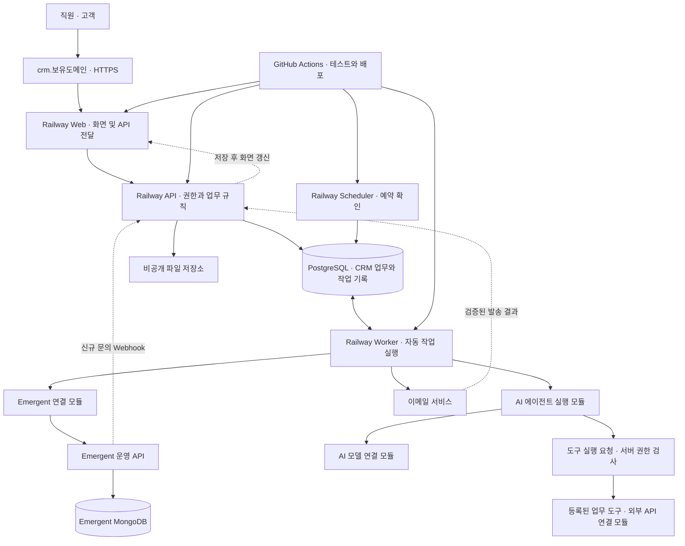
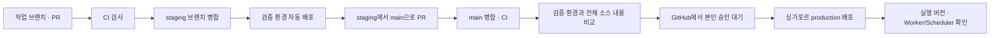

# Railway 기반 CRM 자동화 확장 구조 — 3차안

작성일: 2026-09-12. 상태: 싱가포르·실시간 신규 문의·CRM 단독 수정·브랜치/승인 정책 반영. 실제 앱·계정 연결 전.

## 1. 이번 결정

사용자가 말한 ‘확정성’은 문맥상 **확장성**으로 해석한다. 기능이 늘어나는 것과 사용량이 늘어나는 것 모두에 대비한다. 권장안은 **기능별 모듈을 가진 업무 서버 + 별도 자동 작업 실행기 + 영속 작업 저장소**다. 처음부터 기능마다 서버를 만들지 않고, 실제 부하가 큰 기능을 나중에 독립시킨다.

- 서비스 실행·배포: Railway 싱가포르 `asia-southeast1-eqsg3a`. 네 서비스 설정에 반영. PostgreSQL도 같은 지역에 생성하고 백업은 별도로 구성.
- 주소: `crm.example.com` 형태의 전용 서브도메인. 실제 보유 도메인으로 교체.
- 외부 데이터: 수정 가능한 Emergent 운영 API와 신규 문의 Webhook 사용. MongoDB 직접 연결은 기본 구성에 포함하지 않음.
- CRM 업무·실행 이력·고객 수정본: PostgreSQL을 기준 저장소로 채택하는 구성. 접수 원문과 직원 수정본을 분리하고 수정본을 Emergent에 역동기화하지 않음.
- 개발·배포: 작업 브랜치 → PR → staging → PR → main. main 배포는 GitHub에서 본인 승인 후에만 진행.
- 신규 문의 표시: 정상 상태에서 접수 저장부터 열린 CRM 화면 표시까지 p95 5초 이내를 제안 목표로 설정. 아직 측정된 성능은 아님.
- AI 에이전트 확장: AI 모델 호출과 업무 도구용 외부 API 연결을 분리. 사용할 공급자와 도구 목록은 미정.
- AI 기본 권한: 해당 회사 전체 영업건의 영업 기록과 다음 행동을 CRM에 직접 반영. 담당자가 달라도 관리할 수 있으며 다른 회사 데이터에는 접근하지 못함. 사용자·역할·권한·시스템 설정 변경은 금지. 아래 3.2가 기존의 모든 AI 업무 변경에 대한 사전 승인 제안을 대체한다.

싱가포르 식별자는 Railway 공식 지역 목록을 확인했다. 코드 설정은 새 배포에 적용되며 실제 프로젝트가 생성되거나 기존 DB가 이동한 것은 아니다. [Railway 지역](https://docs.railway.com/deployments/regions)
- 업무 기준: 기존 첫 연락 기한, 15:00·16:30 안내, 직원 승인, 최초 포함 총 3회 정책 유지.

무제한 처리량·무중단·정확히 한 번의 외부 발송은 구조만으로 보장되지 않는다. 배포 전 부하·장애·복구 시험으로 지원 범위를 확인한다. Railway의 복제 수 확장은 서비스 설정에서 조정하는 방식이므로 ‘사용자가 늘면 복제 수가 알아서 늘어난다’고 전제하지 않는다. [Railway 확장 문서](https://docs.railway.com/deployments/scaling)

## 2. 전체 구조

Web의 `/api/*`가 내부 API로 전달한다. 브라우저에는 하나의 CRM 주소를 제공한다. Worker·Scheduler·PostgreSQL에 공개 도메인을 연결하지 않는다. Railway 내부 통신과 Emergent의 외부 HTTPS 통신은 서로 다른 연결이다. [Railway 내부 네트워크](https://docs.railway.com/networking/private-networking)

| 구성 | 역할 | 커질 때의 대응 |
|---|---|---|
| Web | 화면, 로그인 흐름, 내부 API 전달 | 상태를 서버 메모리에 고정하지 않고 복제 확장 |
| API | 상담·업무·권한·승인·기한 계산 | 같은 코드를 실행하는 서버 수 확장 |
| Worker | AI 분석, 이메일, Emergent 연동 | 실행기 수 확대, 이후 작업 종류별 분리 |
| Scheduler | 예정 시각이 지난 작업 등록 | 기본 1개, 실행권 잠금과 고유 키로 중복 방지 |
| PostgreSQL | CRM 데이터, 실행 큐, 이력, 중복 방지 | 인덱스·연결 수·보관 정책 조정 후 자원/구조 확장 |
| Emergent API | 신규 문의 전달·접수 원문 누락 보충 | Webhook과 커서 조회, 수정본 덮어쓰기 없음 |
| 파일 저장소 | 견적·회사소개서 등 비공개 파일 | 객체 저장소 사용, DB와 분리 |

초기에는 Web/API/Worker/Scheduler 각각 1개를 제안한다. 동일 저장소에서 배포하되 실행 단위를 나눈다. API와 Worker는 같은 업무 모듈을 재사용할 수 있다. 실제 코드를 확인하기 전 프레임워크를 강제하지 않으며, 새로 작성한다면 TypeScript 기반 Web/업무 서버를 후보로 둔다.

## 3. 기능이 늘어나는 방식

업무 서버 안에 `상담`, `할 일`, `연락`, `계약`, `서비스 제공`, `자동화`, `연동`, `사용자·권한` 모듈을 둔다. 모듈별 데이터 변경은 해당 모듈의 함수를 통해 수행한다.

자동화는 다음 형식으로 추가한다.

| 항목 | 예시 |
|---|---|
| 계기 | 상담 접수, 메모 새 버전 저장, 다음 확인 날짜 도달 |
| 조건 | 미완료, 관리 제외 아님, 아직 해당 알림을 보내지 않음 |
| 실행 | AI 분석, 직원 알림, 승인된 이메일 발송 |
| 승인 | 고객에게 나가는 후속 메일은 직원 승인 필요 |
| 버전 | 규칙 버전·입력 버전·승인 내용 버전 저장 |
| 결과 | 성공, 재시도 대기, 수동 확인, 최종 실패 |

처음에는 개발자가 등록한 자동화만 실행한다. 복잡한 화면형 자동화 편집기나 임의 코드 실행 기능은 이번 범위에 넣지 않는다. 나중에 장기간 대기·다단계 승인·취소 보상이 크게 늘면 전용 워크플로 엔진을 평가한다.

한 기업부터 시작하되 `tenant_id`를 업무·연락·파일·작업·감사 기록에 포함한다. API는 로그인으로 확인한 기업과 담당자 권한을 서버에서 검증한다. 고유 키와 관련 데이터 연결에도 기업 구분을 포함해 기업 간 데이터 혼선을 방지한다.

### 3.1 AI 에이전트와 외부 API

사용자는 외부 API를 AI 에이전트에 활용할 계획이다. 구체적인 도구와 공급자는 아직 미정이므로 아래는 이를 수용하기 위한 설계다. 외부 서비스를 실제로 연결하거나 에이전트를 구현한 상태는 아니다.

| 연결 종류 | 역할 | 후보 기능 |
|---|---|---|
| AI 모델 API | 메모를 해석하고 다음 행동 후보·초안을 생성 | 상담 요약, 요청 분류, 후속 행동 제안 |
| 에이전트 도구 API | 필요한 정보를 조회하거나 승인된 행동 수행 | 허용된 자료 검색, 일정 조회, 이메일 발송 등. 실제 도구 선정 전의 예시 |
| Emergent API | 신규 문의 전달·원문 누락 보충 | 기존에 정한 수집 경로. 에이전트 판단을 기다리지 않음 |

초기 에이전트는 기존 Worker 안의 별도 모듈로 실행한다. 무거운 AI 작업이 누적되면 같은 실행 기록·도구 계약을 사용하는 전용 AI Worker로 분리한다. 처음부터 에이전트마다 서버를 만들 필요는 없다.

실행 흐름은 `업무 이벤트 → AI 작업 등록 → 허용된 맥락 조회 → 모델의 도구 호출 제안 → 서버의 권한·입력 검사 → 직접 반영 또는 승인 대기 → 결과·이력 저장`이다. 모델이 출력한 도구 이름이나 URL을 그대로 실행하지 않고, 서버에 등록된 도구만 이름·입출력 형식·허용 범위로 연결한다.

- 읽기: 회사가 위임한 자동 영업 관리에서는 해당 회사 전체 영업건과 미리 허용한 외부 조회 도구를 사용한다. 직원에게 보여주는 결과는 그 직원의 접근 권한으로 별도 제한한다. 조회 요청에 외부로 보내는 고객 정보도 최소화하고 연결별 허용 범위를 적용한다.
- 직접 반영: 영업 활동 기록, 상담 요약, 다음 행동, 기한·다음 확인 날짜를 원문·근거·이력과 함께 CRM에 저장할 수 있다. 허용 여부는 3.2의 권한 정책으로 판정한다. 근거가 불명확하면 검토 대상으로 남긴다.
- 실행: 고객 후속 이메일 등 외부 행동은 수신자·내용·첨부파일을 직원이 승인한 버전으로 고정해 실행한다. 도구 결과나 AI 출력은 승인으로 취급하지 않는다.
- 정해진 자동 처리: 접수 확인 메일·15:00/16:30 직원 알림은 기존 규칙으로 실행한다. 이 경로에 매번 AI 판단이나 새 직원 승인을 추가하지 않는다.
- 기록: `agent_run_id`, 연결 상담·기업·직원, 입력 버전, 도구 이름·버전, 실행 단계·결과, 승인 ID, 호출량·지연을 보관한다. 비밀키와 불필요한 고객 원문을 로그에 남기지 않는다.
- 제한: 한 실행의 최대 단계 수·시간·호출 예산을 설정한다. 한도 도달 시 중단·확인 필요로 표시한다. 재시도는 기존 최초 포함 총 3회 정책과 연결하고, 에이전트 루프와 API 클라이언트가 각각 반복해 횟수를 곱하지 않도록 한 곳에서 관리한다.
- 중복 방지: 외부 변경 작업은 승인 ID·업무·내용 버전에 연결한다. 결과가 불명확한 발송을 에이전트가 새 계획으로 우회 재발송하지 못하게 한다.
- 실패: 외부 API나 AI가 중단돼도 신규 문의 표시·담당자 배정·수동 업무 처리는 유지한다. 고객 메모나 검색 결과 안의 지시문은 업무 데이터로 취급한다.

외부 API 키와 인증 갱신은 Railway 서버의 연결 모듈이 관리한다. 에이전트 프롬프트나 브라우저에 비밀값을 넣지 않는다. API가 바뀌면 해당 연결 모듈을 수정하고 계약 검사를 수행한다.

처음 구현할 에이전트 범위는 **상담 메모와 허용된 자료를 읽고 영업 기록·다음 행동을 CRM에 직접 반영하며, 후속 연락 초안을 작성하는 것**으로 구체화한다. 사용할 외부 API는 이 업무에 필요한 정보·행동을 정한 뒤 선정한다. 구조 변경 없이 연결 모듈을 추가할 수 있도록 도구별 인증·형식·시간 제한·승인 조건·오류 규칙을 정의한다.

### 3.2 초기 AI 에이전트의 기본 권한

영업 실무를 처리할 수 있는 별도 `sales_agent` 역할을 설계한다. 사람 관리자 계정을 공유하지 않는다. 이 역할은 아직 실제 인증 시스템에 생성되지 않았으며, 아래는 구현할 권한 기준이다.

| 구분 | 기본 권한 |
|---|---|
| 영업 정보 조회 | 해당 회사 전체 영업건 조회. 담당자와 무관하게 관리하며 다른 회사는 제외 |
| 영업 활동 기록·상담 요약·후속 연락 초안 | CRM에 직접 작성·수정 |
| 다음 행동·할 일·기한·다음 확인 날짜 | 업무 규칙 안에서 직접 생성·수정 |
| 진행 단계·업무 완료 | 실제 수행 기록과 상태 전환 조건을 검증할 수 있을 때 반영. 근거가 없으면 제안으로 보류. 영업건 종료는 아래 직원 확인 규칙 적용 |
| 영업건 종료 | AI가 종료 사유·근거·남은 업무를 정리해 제안하고 직원이 확인한 뒤 종료. 확인 전에는 진행 상태와 알림 유지 |
| 기존 영업건 담당자 변경 | AI는 변경 사유와 후보를 제안만 함. 담당자 변경 권한이 있는 직원이 확인 후 확정 |
| 고객 후속 이메일·문자 등 외부 연락 | 기존 직원 승인 정책 유지. 내부 기록 수정 권한으로 외부 발송 권한이 생기지 않음 |
| 사용자 생성·삭제, 역할·권한 변경 | 허용하지 않음 |
| 시스템 설정·연동 키·배포·보안·사용 예산·자신의 도구 권한 변경 | 허용하지 않음 |

서버가 작업마다 `기업 범위 + 기록 접근 범위 + 허용된 도구/필드 + 업무 규칙`을 검사한다. 프롬프트에 금지사항을 적는 것만으로 권한을 구현하지 않는다. 시스템 설정 API는 에이전트 도구로 노출하지 않고 에이전트 자격증명으로 호출해도 거부한다.

전체 영업건 범위는 사용자가 선택했다. AI의 회사 단위 자동 관리에는 다른 담당자의 영업건도 포함한다. 사람 직원의 조회·수정 권한을 함께 확대하지 않는다. 직원이 AI에 요청한 조회 결과와 직접 지시한 변경은 직원 자신의 권한으로도 검사하고, 회사가 위임한 자동 관리 실행과 구분한다. 직원이 AI를 거쳐 다른 담당자의 정보를 얻거나 임의 변경하는 우회 경로를 만들지 않는다.

영업 기록에 입력된 문장은 실제 행동의 증거와 구분한다. ‘전화해야 함’을 ‘전화 완료’로 처리하거나, 이메일 초안 작성만으로 ‘발송 완료’로 변경할 수 없다. 기한 변경은 원래 기한과 이유를 남기며 첫 연락 SLA 기준 자체는 변경하지 못한다. 고객 요청으로 정해진 일정과 충돌하면 검토 대상으로 남긴다.

고객 요청에 날짜가 없고 적용할 확정 업무 규칙도 없는 후속 업무는 AI가 임의 기한을 만들지 않는다. 할 일과 담당자는 등록하고 `due_at=null`, `deadline_status=needs_confirmation`으로 저장한다. 업무 상태는 기존의 미완료를 유지한다. 오늘 할 일의 확인 필요 구역에 ‘기한 확인 필요’로 표시하고 담당자가 기한을 정한다. 기한이 없다는 이유로 기한 초과로 판정하거나 목록에서 숨기지 않는다. 이 표시는 완료/미완료 외의 새 업무 상태가 아니라 기한 확인 여부다. 첫 연락은 이미 확정된 1영업일 규칙이 있으므로 해당 기한을 자동 계산한다.

직접 반영에는 수행자 AI, 실행 ID, 변경 전후 값, 근거, 시각을 남긴다. 직원이 수정·되돌리기 할 수 있게 하되 이후 다른 변경을 무조건 덮어쓰지 않고 버전을 확인한다. 이력 삭제 권한은 주지 않는다. 계약 조건 확정·결제 등 아직 정의하지 않은 도구는 영업이라는 이름만으로 자동 허용하지 않고 개별 명세 때 범위를 정한다.

영업건 종료는 명확한 고객 거절이 있어도 AI 단독으로 실행하지 않는다. AI는 종료 제안을 저장하고, 권한 있는 직원이 종료 사유·남은 업무·중단될 알림을 확인해 승인한다. 서버는 실제 승인자와 확인한 상담 버전을 검증한다. AI가 요청 본문에 승인 여부를 넣는 것만으로 사람 승인을 인정하지 않는다. 승인 전에는 알림을 중단하지 않고, 종료 후에도 미완료 업무와 변경 이력을 보존한다.

기존 영업건의 담당자 변경도 AI는 제안만 한다. 변경 권한이 있는 직원이 대상 직원·변경 이유·영향받는 미완료 업무를 확인하고 확정한다. 초기의 담당자 변경 권한은 관리자에게 둔다. AI가 상담/업무 수정 API의 담당자 필드로 이 절차를 우회할 수 없게 한다. 새 문의는 기존의 전담 직원 자동 배정 규칙을 그대로 적용한다. API별 입력·권한·응답은 [핵심 업무 API 계약](04d-core-api-contract.md)을 따른다.

## 4. Emergent와 PostgreSQL의 데이터 소유권

사용자 요청에 따라 **문의 최초 접수 원문은 Emergent, 실제 CRM 운영과 수정본은 CRM**으로 역할을 정한다. 기존의 ‘고객 수정은 Emergent API로 반영’ 제안은 폐기한다. 저장소를 따로 두는 비용은 실제 계정 구성 때 확인한다.

| 데이터 | 기준 저장소 | CRM에서의 처리 |
|---|---|---|
| 최초 고객 정보·상담 접수 원문 | Emergent 및 CRM 원문 보관 | 접수 ID·원래 접수 시각과 함께 수집. 수집 후 원문을 직원 수정본으로 대체하지 않음 |
| 고객 연락처·메모 등 직원 수정본 | CRM PostgreSQL | CRM에서만 수정·이력 관리. Emergent 재수신으로 덮어쓰지 않음 |
| 담당 직원·상담 진행 단계·다음 행동·기한·완료 기록 | CRM PostgreSQL | CRM이 기준. Emergent로 역동기화하지 않음 |
| AI 제안·원문 버전·승인 기록 | CRM PostgreSQL | 원문과 근거 보관, 승인 후 반영 |
| 예약·재시도·중복 키·실행 이력 | CRM PostgreSQL | Worker/Scheduler가 공통 사용 |
| 첨부파일 | 비공개 객체 저장소 | CRM은 파일 정보와 접근 권한 보관 |

왜 PostgreSQL을 추가하는가: 외부 API가 중단돼도 이미 접수된 업무와 예약 실행 기록을 보존하고, ‘업무 저장 + 자동 작업 등록’을 같은 트랜잭션에서 처리하기 위해서다. PostgreSQL 도입·비용은 아직 실제 계정에서 실행하지 않았다.

### 기존 Emergent 상담 수집

1. Emergent가 문의와 전송할 이벤트를 함께 영속 저장한다. 문의 저장 직후 CRM Webhook을 호출한다.
2. CRM은 서명·필드 검증 후 수신 기록, 상담, 담당자, 첫 연락 업무, 화면 갱신 이벤트를 같은 트랜잭션으로 저장하고 응답한다. AI·메일 호출은 이 요청에서 기다리지 않는다.
3. 저장 후 SSE로 현재 로그인한 담당자의 열린 CRM 화면에 변경을 알린다. 화면은 최신 목록을 다시 조회한다. API가 여러 개여도 공유 변경 기록으로 이벤트를 전달한다.
4. 전달 실패 시 같은 이벤트 ID로 재시도한다. 보조 경로로 60초 간격의 커서 조회를 수행해 누락된 접수를 수집한다. 성공 저장 뒤에만 커서를 전진시킨다.
5. `기업 + 출처 + 접수 ID`로 상담 중복을 막는다. 직원이 수정한 값은 기존 접수 재수신 시 유지한다. 같은 전화번호로 새 접수가 들어오면 새로운 상담 건으로 취급한다.
6. Emergent에서 나중에 수정·삭제·취소된 값은 원문 변경 이력/검토 대상으로 기록한다. CRM 수정본이나 업무를 자동으로 삭제·종료하지 않는다.

세부 전송·서명·복구 계약과 화면 갱신은 [신규 문의 연동 명세](04c-emergent-realtime-ingestion.md)에 정의한다. SSE는 서버에서 브라우저로 변경을 전달하는 연결 방식이다. [SSE 설명](https://developer.mozilla.org/en-US/docs/Web/API/Server-sent_events/Using_server-sent_events)

첫 연락 기한은 **원래 접수 시각**을 기준으로 계산한다. 뒤늦게 동기화됐다고 다음 영업일을 새로 부여하지 않는다.

### CRM 공개 폼에서 새로 접수하는 경우

이번 기본 접수 경로는 기존 Emergent 폼이다.
향후 CRM 자체 공개 폼도 운영하면 CRM 원문·상담·첫 연락 업무·자동 작업 요청을 하나의 로컬 트랜잭션으로 저장한다. 출처는 `crm`으로 구분하고 Emergent에 자동 복제하지 않는다. 고객 수정본을 Emergent로 다시 보내는 경로는 만들지 않는다. 기존 Emergent 접수와 새 CRM 접수의 ID 공간을 구분한다.

### 먼저 확인할 외부 API 계약

운영 URL, 인증 방식, 고객·접수 ID, 접수 원래 시각, 안정적인 이벤트 커서, 이벤트 서명과 재시도, 호출 한도, 백업을 확인하고 필요한 API를 수정·추가한다. 사용자가 API 수정 가능함을 확인했으나 실제 코드·주소는 아직 제공되지 않았다. 명세의 경로는 새로 구현할 계약이며 현재 Emergent에 존재한다고 확인한 주소가 아니다.

운영용 API를 사용한다. Emergent의 미리보기와 운영은 별도 환경과 데이터베이스이므로 미리보기 주소를 운영 연동 주소로 사용하지 않는다. [Emergent 환경 설명](https://help.emergent.sh/platform-documentation)

## 5. 자동 작업의 확장과 복구

처음에는 PostgreSQL의 영속 작업 테이블을 사용한다. 짧은 트랜잭션으로 처리 대상을 선점하고, 외부 호출 동안 DB 행 잠금을 계속 잡아두지 않는다. 큐 소비에 `FOR UPDATE SKIP LOCKED`를 활용할 수 있다. 이는 업무 조회 일반에 쓰는 일관성 보장 수단이 아니라 작업 선점 방식이다. [PostgreSQL SELECT 문서](https://www.postgresql.org/docs/current/sql-select.html)

- 작업마다 종류, 기업, 대상, 내용 버전, 실행 예정 시각, 시도 횟수, 실행권 만료, 결과, 외부 발송 ID를 저장한다.
- 작업을 받은 실행기만 완료 기록을 쓸 수 있도록 실행권 토큰을 검증한다. 긴 작업은 실행권을 갱신한다.
- 재시작하면 만료된 실행권을 확인한다. 외부 발송 여부가 불명확하면 조회·대조 후 처리한다.
- 중복 방지 키와 DB 고유 제약으로 내부 중복 등록을 막는다. 외부 발송까지 정확히 한 번임을 단정하지 않는다.
- 일시 실패는 최초 포함 총 3회. 인증/형식 오류는 원인 수정 전 반복하지 않는다. 제한 응답은 허용 시각까지 대기한다.
- Worker의 최대 동시 실행 수와 공급자별 전역 호출 한도를 구분한다. 실행기를 늘려도 전체 AI/메일 한도를 초과하지 않도록 공유 제한을 둔다.
- 비용 한도에 도달한 AI 작업이 직원의 상담 확인·수동 업무 입력을 막지 않게 한다.

작업 대기 시간이 길어지면 이메일·AI·동기화 Worker를 분리한다. DB 작업 선점 자체가 병목이라는 측정 결과가 나오면 Redis 기반 큐 등을 검토하되, 업무 변경과 작업 요청을 함께 저장하는 기록 및 복구 경로는 유지한다.

Scheduler는 상시 실행하며 약 15초 간격으로 저장된 예정 시각을 조회하는 제안이다. 영업일 15:00 통합 알림과 16:30 첫 연락 알림을 개별 규칙으로 등록한다. `기업 + 규칙 + 영업일 + 직원` 고유 키로 등록 중복을 막고 발송 직전에 현재 업무 상태를 다시 확인한다. 메일 재시도는 새 알림 건을 생성하지 않고 같은 실행 기록을 사용한다.

한국 시간·공휴일 달력 버전을 보관하고, 장애 후 당일 17:00 전까지만 누락 알림을 보충하는 기존 제안을 유지한다. 이후는 지연/미실행으로 기록한다. 실행 지연을 측정하고 알린다. 이는 초 단위 실행을 보장하는 SLA는 아니다.

Railway Cron은 UTC 기준이며 실행 시각이 몇 분 늦어질 수 있고, 이전 실행이 종료되지 않으면 다음 실행을 건너뛴다. 따라서 이번 주기적 실행 이력 관리에는 별도 Scheduler를 선택했다. GitHub Actions의 예약 실행을 고객 업무 스케줄러로 사용하지 않는다. [Railway Cron 제약](https://docs.railway.com/cron-jobs)

## 6. 도메인과 권한

- 운영: `https://crm.example.com`.
- 검증: 별도 Railway 제공 주소 또는 `https://crm-staging.example.com`.
- Web만 공개하고 `/api/*`를 내부 API로 전달한다. 원래 `/api` 경로를 제거한 뒤 전달하는 규칙으로 통일한다.
- 변경 알림용 공개 경로도 동일 주소 아래 두되, 공급자 서명·이벤트 ID·시간 검증을 적용한다.
- 직원 인증은 검증된 인증 라이브러리/서비스로 구현한다. `HttpOnly`, `Secure` 세션, CSRF 방어, 서버 권한 검증을 적용하고 브라우저에 외부 API 토큰을 전달하지 않는다.
- Web/API의 로컬 파일·메모리에 세션이나 작업의 유일한 기록을 두지 않는다.

Railway의 Web 서비스에 도메인을 등록한 후, Railway가 실제로 표시한 DNS 레코드와 소유권 확인 값을 도메인 관리 화면에 입력한다. 값을 임의로 만들지 않는다. 검증과 HTTPS 적용을 확인한 뒤 로그인 리디렉션·허용 출처·웹훅 URL을 갱신한다. 기존 회사 홈페이지 주소는 유지한다. [Railway 도메인 연결](https://docs.railway.com/networking/domains/working-with-domains)

## 7. GitHub Actions CI/CD

제공 파일은 [연결·배포 안내](../infra/railway/README.md)에 설명했다. 실제 앱이 없는 현재는 인프라 검사만 실행할 수 있다. `CRM_APP_READY`, `CRM_DEPLOY_ENABLED`를 모두 활성화하고 앱 테스트·컨테이너·환경 설정을 갖춰야 배포된다. 활성화 여부만으로 누락된 앱 검사를 통과시키지는 않는다.

CI는 staging/main 대상 PR과 해당 브랜치 push를 검사한다. main PR은 같은 저장소의 staging 브랜치에서만 받도록 검사한다. staging push는 검증 환경 자동 배포, main push는 운영 검증 후 승인 대기로 이어진다. GitHub 브랜치 규칙에서 직접 push·강제 push·삭제를 제한하고 PR과 CI를 필수화한다. 로컬 YAML만으로 원격 브랜치 규칙이 설정되지는 않는다.

PR 병합은 커밋 SHA를 바꿀 수 있으므로 staging과 main의 전체 파일 내용 식별자 `sourceTree`를 비교한다. 동일 내용이 검증 환경에서 실행 중이어야 한다. 충돌 해결 등으로 파일이 달라졌다면 staging에서 다시 검증한다. 검증 환경을 새 버전으로 먼저 교체해도 이전 버전의 검증이 자동 인정되지는 않으므로 운영 승인까지 해당 릴리스를 유지하는 절차를 따른다.

production Environment에 본인 계정 하나를 Required reviewer로 지정하고, 본인도 승인할 수 있도록 Prevent self-review는 끈다. 관리자 우회는 끈다. main만 배포 가능하게 한다. GitHub에서 Review deployments → production → Approve and deploy를 누르기 전에는 운영 배포 job이 실행되지 않는다. 승인 후에도 현재 실행의 승인 기록이 본인인지 조회하며, 설정 누락·승인 없음·조회 실패 시 배포를 중단한다. [GitHub 배포 승인](https://docs.github.com/en/actions/how-tos/deploy/configure-and-manage-deployments/manage-environments)

승인 이력 API가 실행 재시도 번호를 구분하지 않으므로 production의 Re-run은 차단한다. 실패 후에는 main에서 새 workflow_dispatch 실행을 만들고 다시 승인한다. 동일 환경의 동시 배포는 직렬화한다. GitHub 동시성 그룹이 모든 대기 버전을 차례로 배포하는 큐는 아니다. [GitHub concurrency](https://docs.github.com/en/actions/concepts/workflows-and-actions/concurrency)

Railway 프로젝트 토큰은 환경별로 분리해 GitHub Environment secret에 저장한다. 해당 환경 토큰과 서비스 ID를 조합해 배포한다. Railway GitHub 자동 배포는 꺼서 Actions와 이중 배포하지 않는다. [Railway CLI 배포](https://docs.railway.com/cli/deploying)

컨테이너에는 커밋 ID, 전체 소스 내용 ID, 실행 ID를 담은 `release.json`을 포함한다. CI가 API와 Web의 실행 버전, Worker/Scheduler의 최근 실행 신호를 확인해야 배포 성공으로 판단한다. 단순 HTTP 200이나 CLI의 빌드 성공만으로 완료하지 않는다.

현재 파일은 같은 커밋을 Railway에서 다시 빌드하는 방식이다. CI가 만든 컨테이너 이미지와 바이트 단위로 같은 이미지를 승격하는 방식은 아니다. 앱 의존성 잠금 파일·Docker 기반 이미지 고정을 적용하고, 향후 릴리스 재현성 요구가 커지면 컨테이너 레지스트리의 동일 이미지 digest 승격으로 전환한다.

## 8. 장애 대비와 운영 검증

| 위험 | 대응 |
|---|---|
| Emergent 지연·중단 | CRM 수정·업무 유지, 신규 문의 전달 지연 표시, 재시도·누락 보충 |
| 일부 Worker 중단 | 실행권 만료·결과 대조 후 재처리, 처리 이력 보관 |
| Worker가 늘어 중복 메일 요청 | 업무 고유 키, 승인 버전, 외부 중복 방지·결과 조회 |
| 배포 중 구/신 버전 공존 | API·작업 메시지·DB의 이전 버전 호환 유지 |
| DB 변경 실패 | 배포와 분리한 마이그레이션, 추가 후 전환 후 정리 순서 |
| DB 자체 장애 | 백업·복원 시험, 목표 복구 시간·손실 허용량 확정. 단일 DB는 고가용성 보장이 아님 |
| Railway 서비스 장애 | 배포 준비 확인 외에 지속 감시·오류 알림·최근 정상 버전 복구 |
| 운영 배포 실패 | 남은 배포 중단, 배포된 버전 목록 확인, 호환되는 이전 버전으로 복구 또는 수정 배포 |

Railway healthcheck는 배포 때 준비 여부를 확인하며 배포 후 상시 모니터링을 대신하지 않는다. 별도 감시에서 API 실패율, 작업 대기 시간, 예약 누락, 외부 API 지연, 최종 실패 수, DB 연결 수를 본다. [Railway healthcheck](https://docs.railway.com/deployments/healthchecks)

설계 제안 목표: 정상적인 외부 서비스와 합의한 시험 부하에서 오늘 할 일 조회 p95 1초 이내, 예약 대상 작업 등록 지연 1분 이내. 데이터 규모·동시 사용자·첨부 크기·외부 한도를 먼저 정한 뒤 측정해야 하며, 달성했다고 확인한 값이 아니다. 기한 내 첫 연락 100%는 계속 업무 목표로 유지한다.

복제 확장 시 DB 연결 수가 함께 늘어난다. `서비스 수 × 복제 수 × 연결 풀 상한`을 계산하고 운영 여유를 둔다. 운영 서비스와 PostgreSQL을 싱가포르에 두며, 설정 단순화를 위해 staging도 같은 지역의 별도 자원으로 제안한다. Emergent 자체의 배치 지역은 아직 확인되지 않았고 이 설정으로 이동하지 않는다.

DB 마이그레이션은 제공 CD에서 자동 실행하지 않는다. 실제 스키마·마이그레이션 도구를 정한 후, 별도 단일 실행 작업과 잠금을 구현한다. 삭제·타입 변경 같은 파괴적 변경을 배포 재시도마다 반복하지 않는다. 롤백도 운영 DB 데이터를 이전 상태로 자동 되돌리는 동작은 아니다.

## 9. 현재 완료 범위와 다음 연결

완료: 확장 구조 설계, Railway 서비스 설정, GitHub Actions 워크플로, 설정 검사와 배포 버전 검사 도구.

미완료: CRM 앱 코드, Emergent 실제 API 계약, 인증·메일·AI·파일 서비스 연결, Railway 프로젝트 생성, GitHub 원격 저장소, 도메인/DNS 연결, 운영 부하·복구 검증. 상시 서비스와 데이터베이스 비용은 계정의 한도에 맞춰 확인해야 하며 무료 운영을 보장하지 않는다.

사용자가 지금 주소나 토큰을 모르는 것은 설계를 막지 않는다. 구현을 시작할 때 실제 Emergent 프로젝트와 GitHub 저장소를 확인하고, 정해진 설정칸을 채운다. 비밀값은 채팅·소스 파일에 붙여넣지 않고 해당 서비스의 비밀값 저장 기능에 등록한다.
